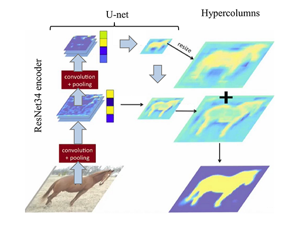

# Pneumothorax-Segmentation-using-Hypercolumns

### This is the submission to a Kaggle competition. Thanks to [Sathvik](https://www.kaggle.com/sathvikpai) for his contributions.

[Link to Notebook](http://nbviewer.ipython.org/urls/raw.github.com/ucalyptus/Pneumothorax-Segmentation-using-Hypercolumns/master/hypercolumns-pneumothorax-fastai.ipynb)

###  Hacktoberfest 2019 Contributors for this repo

- PedroCisnerosSantana;
- Phaturanganamal;
- Pejasvisoi;
- Pasanjayawickrama;
- Pedrohugovm;
- annamunhoz;
- lkalves;
